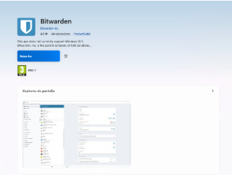
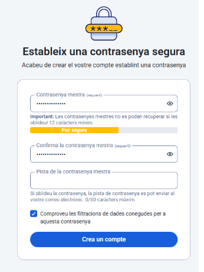
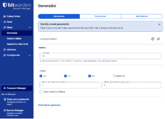
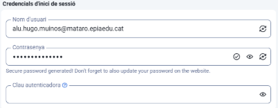
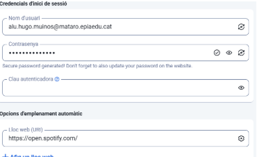
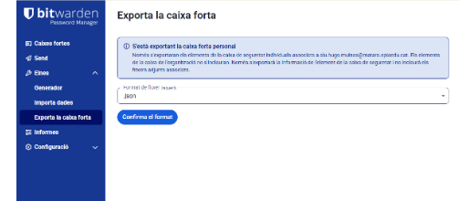
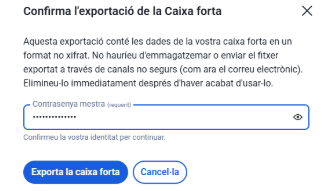

# **Informe: Análisis y Justificación de la Implementación de un Gestor de Contraseñas**

## **Introducción**

Las contraseñas débiles o reutilizadas son un gran riesgo para la seguridad de cualquier empresa. Los ataques más comunes, como el ataque de diccionario o el credential stuffing, se aprovechan de estas debilidades para acceder a cuentas corporativas y robar información sensible. En estos casos, los ciberdelincuentes utilizan listas de contraseñas comunes o reutilizadas para intentar entrar en varios sistemas con credenciales que ya han sido comprometidas.  
Para reducir estos riesgos, es esencial implementar un gestor de contraseñas. Esta herramienta ayuda a crear, almacenar y gestionar contraseñas únicas y complejas, evitando la reutilización y mejorando la seguridad en general. Además, un gestor de contraseñas permite que el personal técnico y otros empleados utilicen sus credenciales de manera segura y eficiente.

## **Comparativa Técnica**

| Característica | Bitwarden (Online / Nube) | KeePassX / KeePassXC (Offline / Escritorio) |
| :---: | :---: | :---: |
| **Sincronización** | Automática y continua a través de la nube, accesible desde cualquier dispositivo con conexión a internet. | Almacenamiento local en un archivo (KDBX). La sincronización es manual (mediante archivos, USB o servicios externos). |
| **Modelo de Seguridad** | Cifrado end-to-end (cifrado local antes de enviar datos a la nube). Servidores propios pero gestionados por Bitwarden. | Cifrado local del archivo KDBX, sin dependencia de la nube. Open source y auditable por la comunidad. |
| **Facilidad de acceso \+1 dispositivo** | Alta, con apps nativas para móvil, navegador y escritorio, sincronización automática. | Limitada, se debe copiar manualmente el archivo entre dispositivos o usar servicios externos (Dropbox, etc.). |
| **Coste freemium** | Modelo freemium con funciones básicas gratuitas y opciones premium con más capacidades (colaboración, autenticación multifactor). | Totalmente gratuito y open source. Sin coste asociado. |
| **Accesibilidad** | Accesible desde cualquier dispositivo con internet. | Depende de la copia física o sincronización manual del archivo. |
| **Dependencia de la nube** | Sí, depende de los servidores de Bitwarden para la sincronización. | No, todo el control está localizado en el archivo KDBX del usuario. |

---

## **Ventajas y Desventajas**

## **Bitwarden (Online / Nube)**

**Ventajas:**

* Sincronización automática e inmediata entre dispositivos.

* Acceso fácil y cómodo desde cualquier lugar.

* Cifrado end-to-end y auditado por terceros.

* Soporte y actualizaciones constantes.

**Desventajas:**

* Dependencia de la nube y de la conectividad a internet.

* Posible exposición en caso de vulnerabilidades en el servidor central.

* Coste potencial para funcionalidades avanzadas.

### **KeePassX / KeePassXC (Offline / Escritorio)**

**Ventajas:**

* Control total sobre los datos (almacenamiento local).

* Open source, con alta transparencia y seguridad.

* Sin dependencia de ningún servicio externo.

* Gratuito y sin coste de mantenimiento.

**Desventajas:**

* Sincronización manual, menos cómodo para usuarios con múltiples dispositivos.

* Mayor responsabilidad en la gestión de los archivos de contraseñas.

## **Recomendación**  
Después de evaluar las diferentes opciones, sugerimos implementar Bitwarden para el equipo técnico de la empresa. Esto se debe a que proporciona una experiencia de usuario superior, gracias a su sincronización automática y fácil acceso desde varios dispositivos, lo cual es fundamental en un entorno laboral ágil y distribuido. Su sistema de seguridad, que incluye cifrado de extremo a extremo, asegura la confidencialidad de la información, y su modelo freemium permite comenzar sin grandes inversiones. 

# **Instalación de Bitwarden**

## **Microsoft store**

Como se ve en la imagen iremos a la aplicación de Microsoft Store donde instalaremos el BitWarden

## **Cuenta**

Seguidamente como  se observa en la   imagen crearemos  una cuenta con  nuestros datos

## **Contraseña**

Seguidamente asignaremos dos contraseñas:

1. Contraseña  
2. Contraseña maestra

## **Generador**

Seguidamente en el apartado  de generador veremos que  nos aparece:

1. Longitud  
2. Parámetros  
3. Carácteres especiales

## 

## **Como guardar credenciales**

En el apartado superior derecho de   
la web en la opción de nuevo   
elegimos “Inicio de sesión”

## 

### Correo electrónico

Seguidamente rellenaremos  
las casillas con nuestros  
datos, en este caso es para  
la cuenta de un correo   
electrónico

## 

### Sitio web

Seguidamente rellenaremos  
las casillas con nuestros  
datos, en este caso es para  
la cuenta de una web, en este   
caso de “[spotify.com](http://spotify.com)”

## **Pasos para exportar y hacer la copia de seguridad**

1. Ves a **Configuración** → **Herramientas**  → **Exportar datos de la caja fuerte**

3. Introduce la contraseña **maestra** para confirmar

3. Guarda el fichero (`bitwarden_export_2025-10-23.json`) en una ubicación segura:
   

 

