# T04: Serveis de directori. LDAP  

## 1️⃣ Creació de la màquina virtual

Un cop dins, actualitzem els paquets:

```bash
sudo apt update && sudo apt upgrade -y
```

Editem el fitxer `/etc/hosts` per definir el domini:

```bash
sudo nano /etc/hosts
```

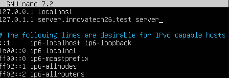

Verifiquem que els canvis s’han aplicat correctament al domini.

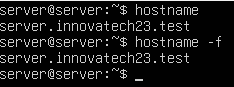

---

## 2️⃣ Configuració de xarxa

Per permetre la comunicació amb l’amfitrió, configurem una interfície **Host-Only**:

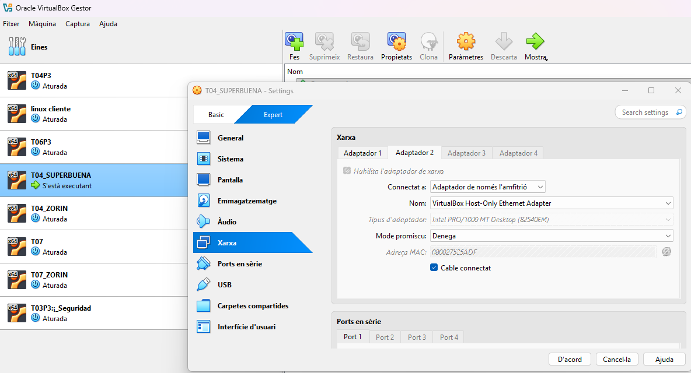

Editarem l’arxiu `/etc/netplan/50-cloud-init.yaml` amb la comanda següent per habilitar la interfície:

```bash
sudo nano /etc/netplan/50-cloud-init.yaml
```


Apliquem els canvis i comprovem la interfície amb `ip a`:

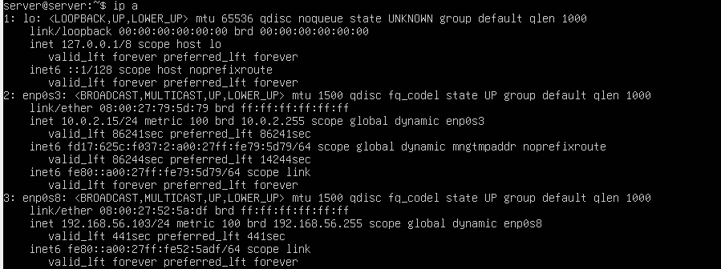

---

## 3️⃣ Instal·lació d’OpenLDAP

Instal·lem el servidor LDAP i les utilitats:

```bash
sudo apt install slapd ldap-utils -y
```

Durant la instal·lació, el sistema ens demanarà la contrasenya de l’administrador. Introduirem `p@ssw0rd`, tal com s’indica al Plec de Condicions Tècniques.

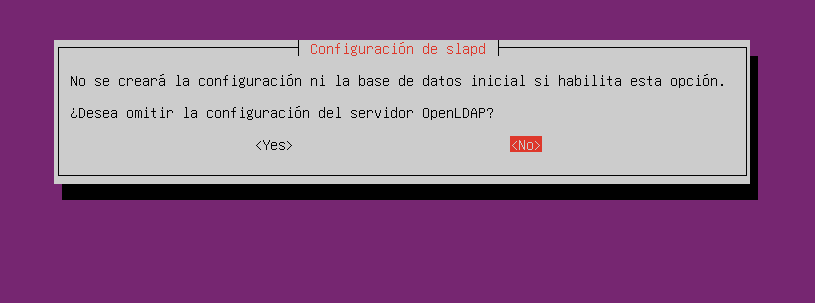
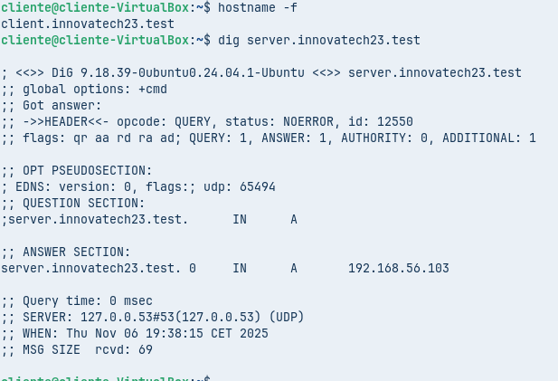
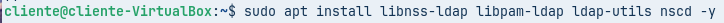
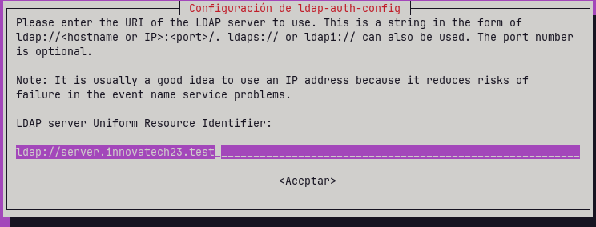

Un cop executada la comanda anterior, comprovarem que el servei s’està executant correctament amb la següent comanda:

```bash
sudo systemctl status slapd
```

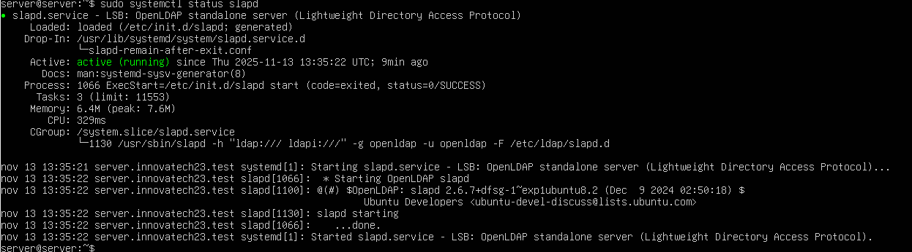

Ara comprovarem que el directori s’ha creat amb el nom desitjat:

```bash
sudo slapcat
```

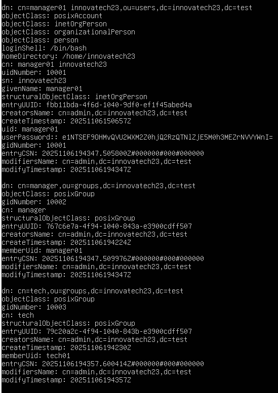

En cas que el nom del directori no sigui el correcte, haurem de reconfigurar el servei amb la següent comanda:

```bash
sudo dpkg-reconfigure slapd
```

---

## 4️⃣ Creació d’unitats organitzatives (OU)

Ara haurem de crear dues unitats organitzatives (*OUs*): **users** i **groups**, mitjançant un fitxer `.ldif`.  

Para hacerlo, en mi caso he creado dos archivos, `OU_users.ldif` `OU_groups.ldif` con la siguiente comanda:

```bash
sudo nano OU_users.ldif
```

A dins del fitxer hi afegirem el contingut següent:

```ldif
dn: ou=users,dc=innovatech26,dc=test
ou: users
objectClass: top
objectClass: organizationalUnit

dn: ou=groups,dc=innovatech26,dc=test
ou: groups
objectClass: top
objectClass: organizationalUnit
```

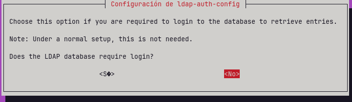
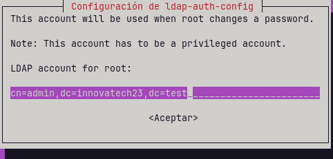


Per crear finalment les OUs, executarem la comanda següent:

```bash
sudo ldapadd -D "cn=admin,dc=innovatech26,dc=test" -W -f OU_users.ldif
```

Para comprobar que se ha hecho correctamente pondremos la siguiente comanda:

```bash
ldapsearch -xLLL -b "dc=innovatech26,dc=test"
```

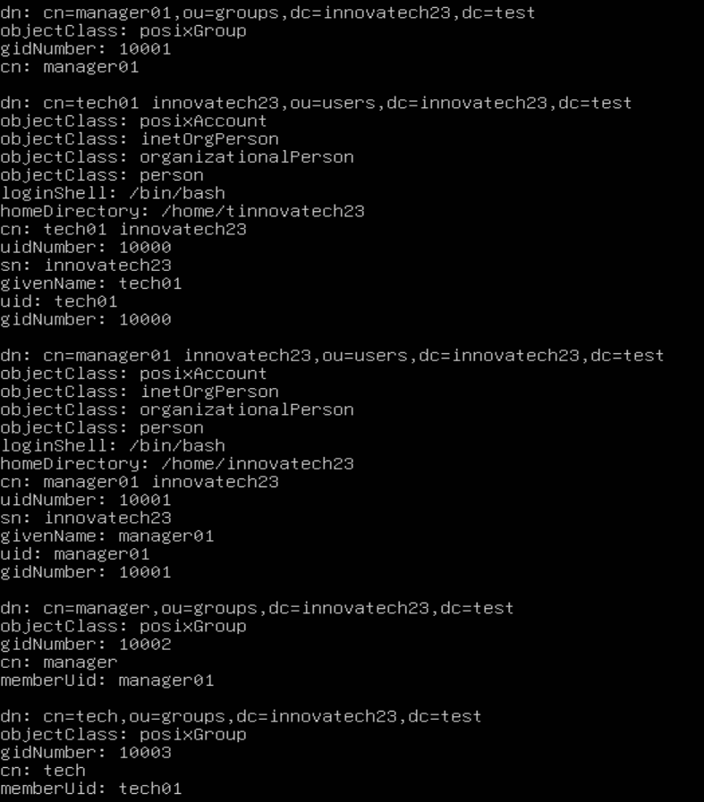

---

## 5️⃣ Instal·lació del gestor LDAP (LAM)

Com que administrar el servidor de domini des de la línia d’ordres pot resultar complex, és recomanable utilitzar un gestor d’usuaris LDAP com **LDAP Account Manager (LAM)**.

Per instal·lar-lo, executarem la comanda següent (el paràmetre `-y` evita que apareguin missatges de confirmació durant la instal·lació):

```bash
sudo apt install ldap-account-manager -y
```

Un cop instal·lat, ens hi connectarem des de la màquina física a través de la interfície **host-only**, introduint la seva adreça IP seguida de `/lam` al navegador:

```
http://IP_DEL_SERVER/lam
```

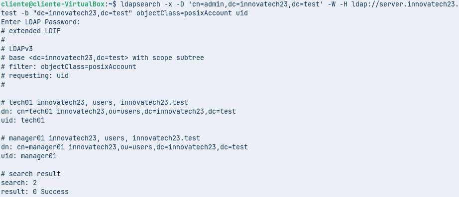

Un cop dins, accedirem a **Edit server profiles** per començar la configuració del perfil del servidor.

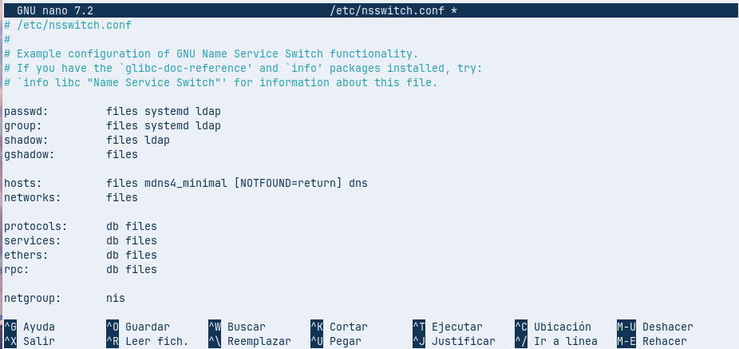

En aquest apartat configurarem les opcions generals del gestor, com ara l’idioma, el compte d’administrador i altres paràmetres bàsics.

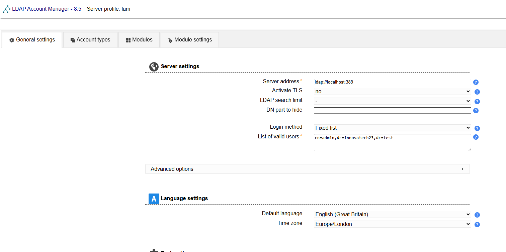

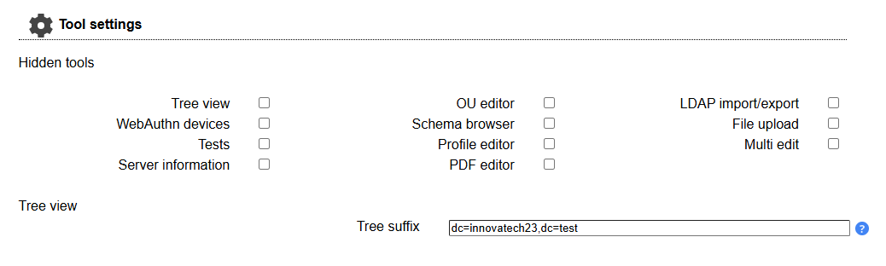

A la segona pestanya **Account Types**, definirem els **DN** dels usuaris i dels grups, incloent-hi una **OU** per als usuaris i una altra per als grups.

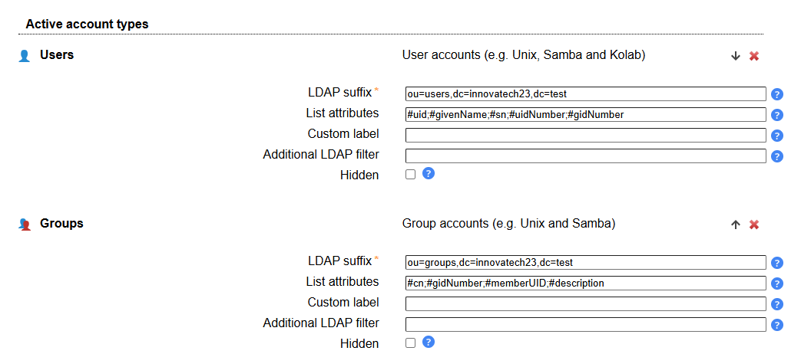

Tot seguit, apareixerà el panell d’inici de sessió, on accedirem amb l’usuari administrador del domini:

```
Usuari: admin  
Contrasenya: p@ssw0rd
```
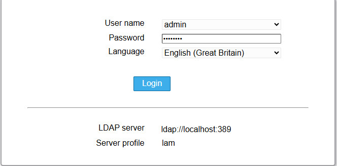

---

## 6️⃣ Creació de grups i usuaris

### Grups

Un cop dins del panell d’administració, hem de crear dos **grups de seguretat** al directori: `tech` i `manager`.  

Per fer-ho, anirem a **Accounts → Groups**.

Un cop dins d’aquest apartat, farem clic a **New group** per crear els dos grups. 

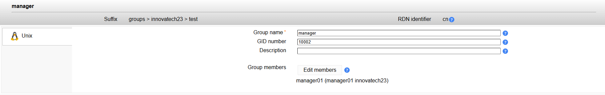

Després de configurar-los, premem **Save** per desar els canvis.

Finalment, ja tenim creats els dos grups al directori.

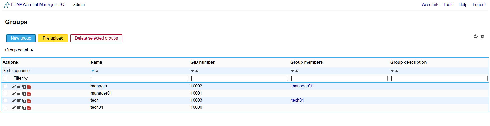

### Usuaris

Repetirem el mateix procés per crear un usuari per a cada grup, anomenats `tech01` i `manager01`.  

Per fer-ho, ens dirigirem a **Accounts → Users** i farem clic a **New user**.

A l’interior del formulari haurem d’introduir la informació personal de l’usuari, com ara l’adreça, el telèfon, la fotografia i altres dades bàsiques.

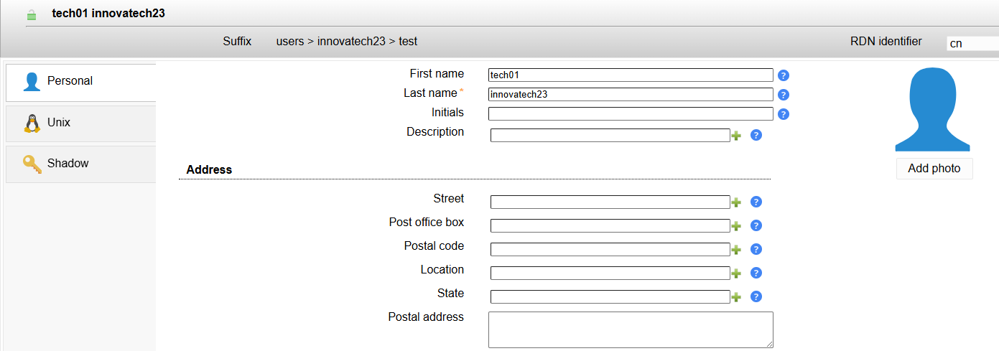

També configurarem la informació **Unix**, necessària perquè l’usuari pugui iniciar sessió al client.  

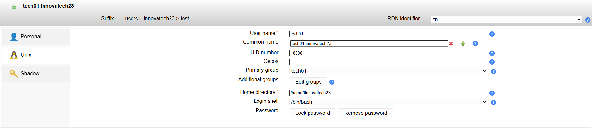

En aquest pas, haurem de crear el **grup primari** amb el mateix nom que l’usuari.

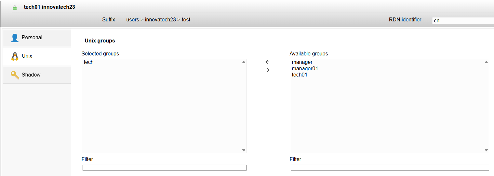

Haurem d’afegir l’usuari al **grup corresponent**.  

Per fer-ho, farem clic al botó **Edit groups** i, un cop dins, mourem el grup `tech` (en aquest cas) a la secció **Selected groups** per assignar-lo correctament a l’usuari.

Finalment, haurem de crear una **contrasenya** perquè l’usuari de domini pugui iniciar sessió.  

Per fer-ho, farem clic al botó **Set password**, introduirem la contrasenya `1234` i marcarem la casella que obliga l’usuari a canviar-la en el **primer inici de sessió**.

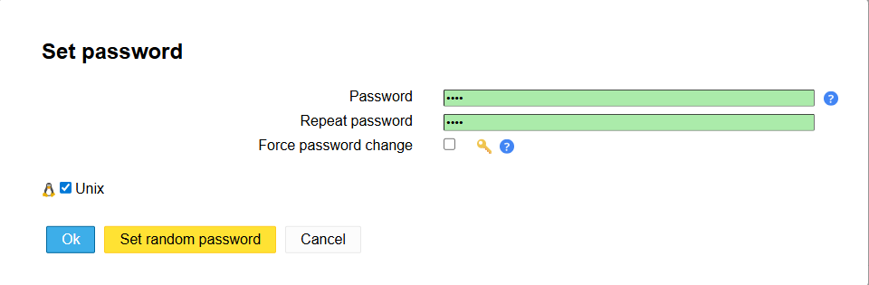

Un cop completats aquests passos, guardarem el nou usuari fent clic al botó **Save**.  

A continuació, repetirem el mateix procés amb l’usuari i el grup `manager01`, obtenint el resultat següent:

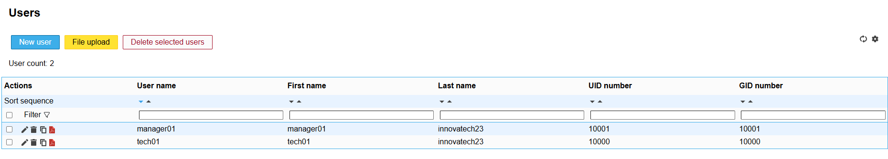

---

## 7️⃣ Configuració del client (ZorinOS)

Per comprovar que el servidor **LDAP** funciona correctament, configurarem un **client ZorinOS**.  

A aquest client li crearem una **segona interfície de xarxa** en mode **host-only**, per tal que pugui comunicar-se amb el servidor.

Un cop dins del client, haurem de **configurar el nom de l’equip** perquè formi part del mateix domini que el servidor.

Com que no disposem d’un servei **DNS**, editarem el fitxer `/etc/hosts` del client per tal que pugui resoldre el nom del servidor correctament.

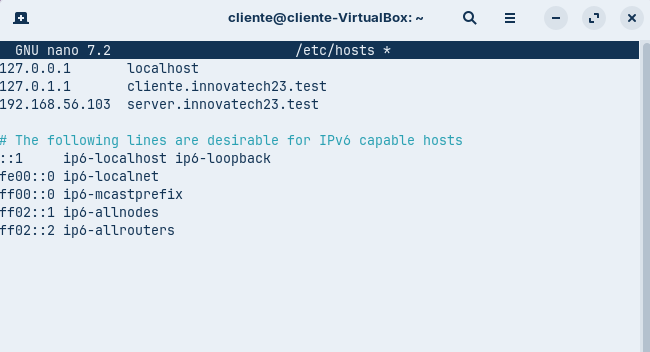

Ara comprovarem que els noms es resolen correctament executant les comandes següents:

### Verificar el nom d’host del client

Per assegurar-nos que el nom de l’equip s’ha canviat correctament:

```bash
hostname -f
```

### Comprovar la resolució del servidor de domini

Per verificar que la resolució DNS cap al servidor de domini és correcta:

```bash
dig server.innovatech26.test
```

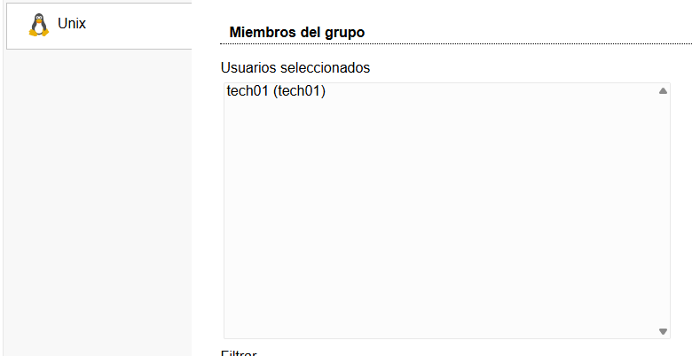

### Instal·lació dels mòduls d’autenticació LDAP

Per poder utilitzar el client dins del domini, hem d’instal·lar els **mòduls necessaris** amb la comanda següent:

```bash
sudo apt install libnss-ldap libpam-ldap ldap-utils nscd -y
```

A continuació, s’iniciarà el procés de configuració dels **mòduls d’autenticació**.


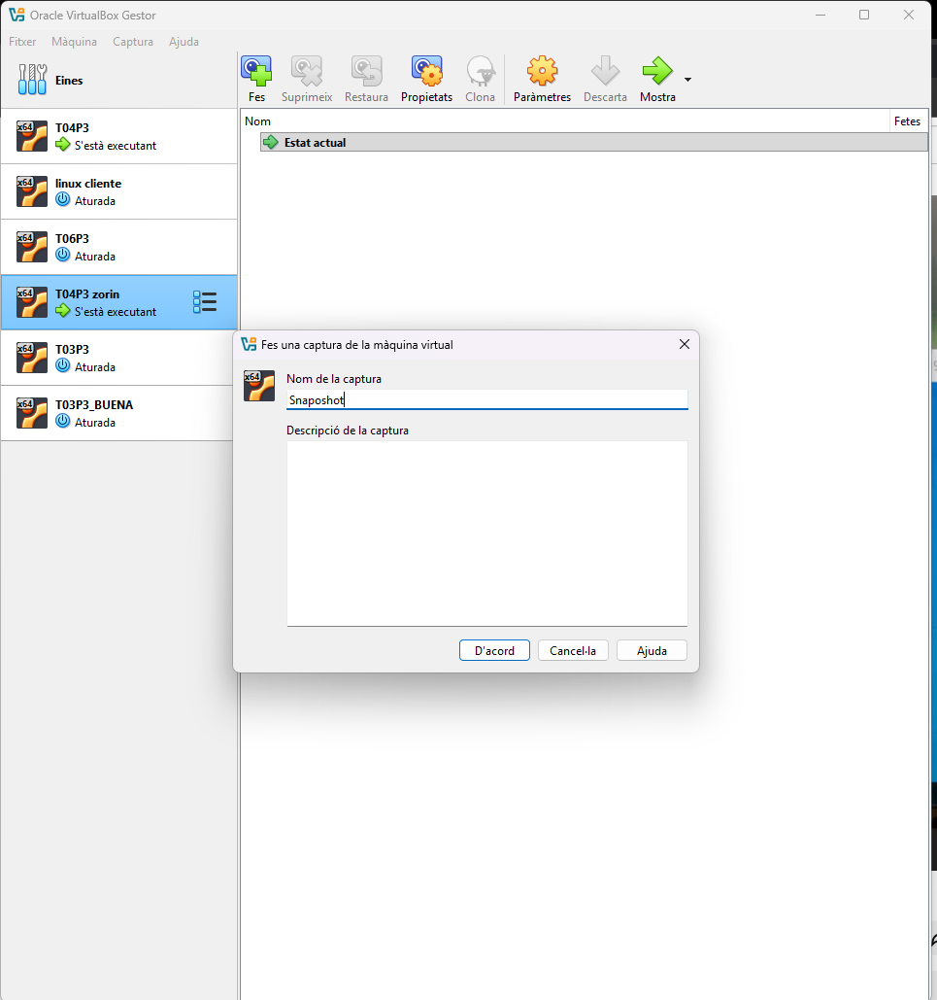
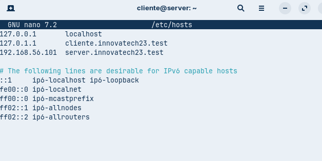
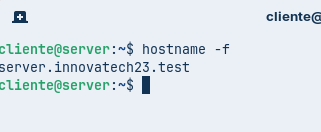
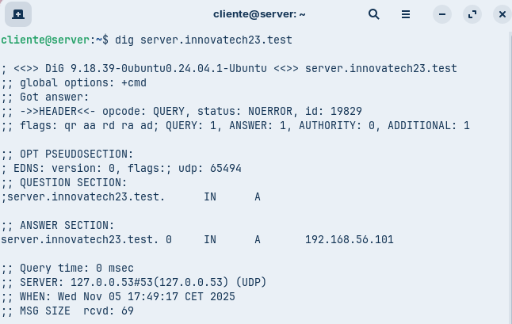

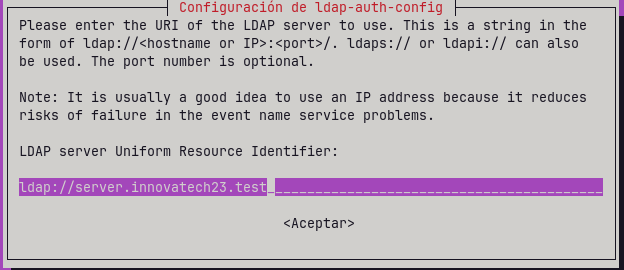

Per comprovar la connectivitat amb el servidor, farem una consulta **ldapsearch** des del client amb la comanda següent:

```bash
ldapsearch -x -D "cn=admin,dc=innovatech26,dc=test" -W -H ldap://server.innovatech26.test -b "dc=innovatech26,dc=test" objectClass=posixAccount uid
```


---

## 8️⃣ Integració PAM i NSS

Ara configurarem l’arxiu `nsswitch.conf` per indicar que s’utilitzarà **LDAP** per a la gestió d’usuaris i grups.

```bash
sudo nano /etc/nsswitch.conf
```

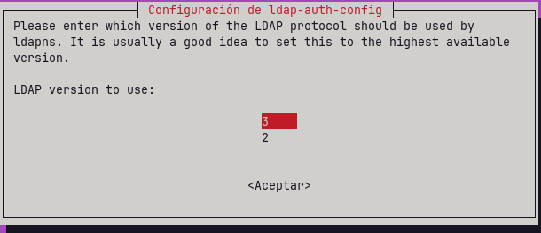

Al fitxer `/etc/pam.d/common-password`, eliminarem la línia que contingui el terme `use_authok`.


Al fitxer `/etc/pam.d/common-session`, afegirem la línia següent per permetre la **creació automàtica dels perfils d’usuari**:

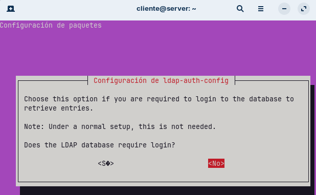

Ara reiniciarem el servei amb la comanda següent:

```bash
sudo systemctl restart nscd
```

Un cop el servei s’hagi reiniciat, comprovarem que detecta correctament els usuaris **LDAP** amb aquesta comanda:

```bash
getent passwd | tail
```

Podem verificar que el sistema mostra correctament els usuaris provinents del directori **LDAP**.

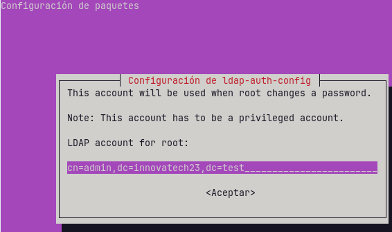

## 9️⃣ Inici de sessió gràfica

Per finalitzar, editarem el fitxer `/etc/pam.d/gdm-launch-environment` per permetre l’inici de sessió gràfica dels usuaris del domini.

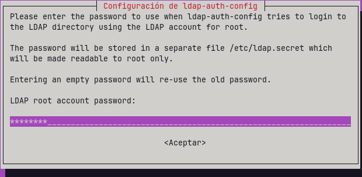

Reiniciarem el client i, a la pantalla d’inici de sessió, farem clic a **Not listed** per introduir manualment un altre usuari.  

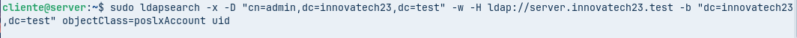

A continuació, introduirem l’usuari `tech01` per iniciar sessió amb les credencials següents:

- **Usuari:** `tech01`
- **Contrasenya:** `1234`

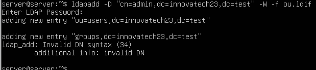

Després d’introduir la contrasenya, apareixerà un missatge indicant que s’està creant el **directori personal** de l’usuari, en aquest cas `/home/tech01`.

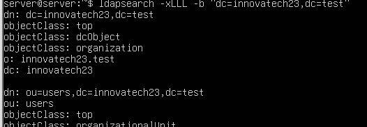

Un cop iniciada la sessió, podem comprovar que tot s’ha creat correctament.

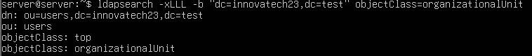

Si repetim el mateix procés amb l’usuari `manager01`, obtindrem el mateix resultat.

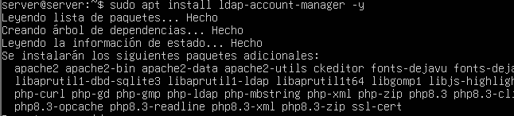

[Tornar a enunciat](README.md)
