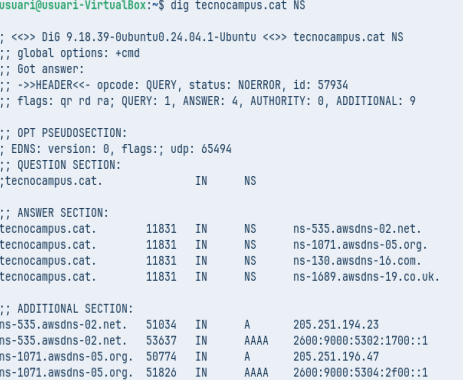
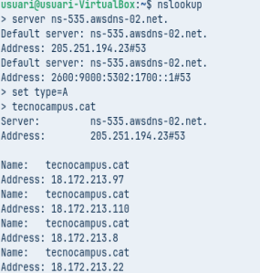
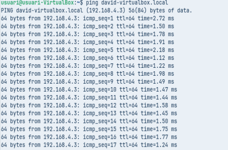

# **FUNDAMENTOS DEL SERVICIO DE DNS**

## **ADAPTADOR**

- Como se puede observar en la fotografía estamos en la aplicación ajustes, donde activaremos el adaptador puente que hemos añadido.

- Para eso tendremos que asignarle una IP y una máscara de red.

# **DIAGNOSTICO DE NOMBRES (AUDITORIA CON CLI)**

## Comanda 1: Consulta Básica de Registro A

### Ejecuta dig xtec.cat A

### Identifica la IP de respuesta, el valor TTL y el servidor que han respondido la consulta:

- IP: 83.247.151.214  
- TTL: 2088
- IP del servidor  que nos ha dado la respuesta: 127.0.0.53

## Comanda 2: Consulta de servidores de nombres (NS)

### Ejecuta dig tecnocampus.cat NS

### Análisi: ¿Cuales son los servidores de nombres autoritativos para este dominio?

- ns-130.awsdns-16.com
- ns-1689.awsdns-19.co.uk
- ns-535.awsdns-02.net
- ns.1071.awsdns-05.org

## Comanda 3: Consulta detallada de SOA

### Ejecuta dig escolapia.cat SOA

### Análisi: ¿Cual es la información del correo del administrador y el número de serie del dominio?

- Correo: root.dns1.nominalia.com
- SN: 1761028965

## Comanda 4: Consulta resolución inversa

### Ejecuta dig -x 147.83.2.135

## Análisi: ¿Que información sobre los registros se obtiene? 

- Se obtiene información sobre la IP indicada

# **Comrpobación de resolución con nslookup (Multiplataforma)**

## Comanda 1: Consulta Básica no Autoritativa

### Seleccionar type=A y como a dominio de consulta tecnocampus.cat

### Anàlisi: Per què indica que la resposta és no autoritativa?

- Ya que cuando haces una consulta sin indicar un DNS, en vez de responderte el servidor autoritativo, te responde normalmente tu proveedor de internter por ejemplo:
  - Google(8.8.8.8)

## Comanda 2: Consultas autoritativas

### Escribir server IP y escribir la IP del primer servidor de nombres del dominio tecnocampus.cat que se ha obtenido de una consulta anterior. A continuación, indicar que quereis consultar registros de tipo A y del dominio tecnocampus.cat

- Haremos el siguiente **dig tecnocampus.cat NS** para obtener el **NS** y asi poder hacer un nslookup autoritativo con la información que nos de

### Anàlisi: Quines diferències s’observen a la resposta obtinguda amb la comanda 1?

- Seguidamente en el nslookup pondremos **server ns-535.awsdns-82.net**, recorar que esta información la hemos sacado del nslookup anterior. Y finalmente haremos lo hecho anterior, **set type=A* y **tecnocampus.cat**.

# RESOLUCIONES LOCALES

## Comanda 1: Ping local

### Finalment es vol comprovar el funcionament de la resolució local, útil per entorns de xarxa local on no es disposa de servidor de noms propi i que evita haver d’accedir a equips o recursos per la seva IP.

- Aqui se observa que el ping se ha realizado correctamente

