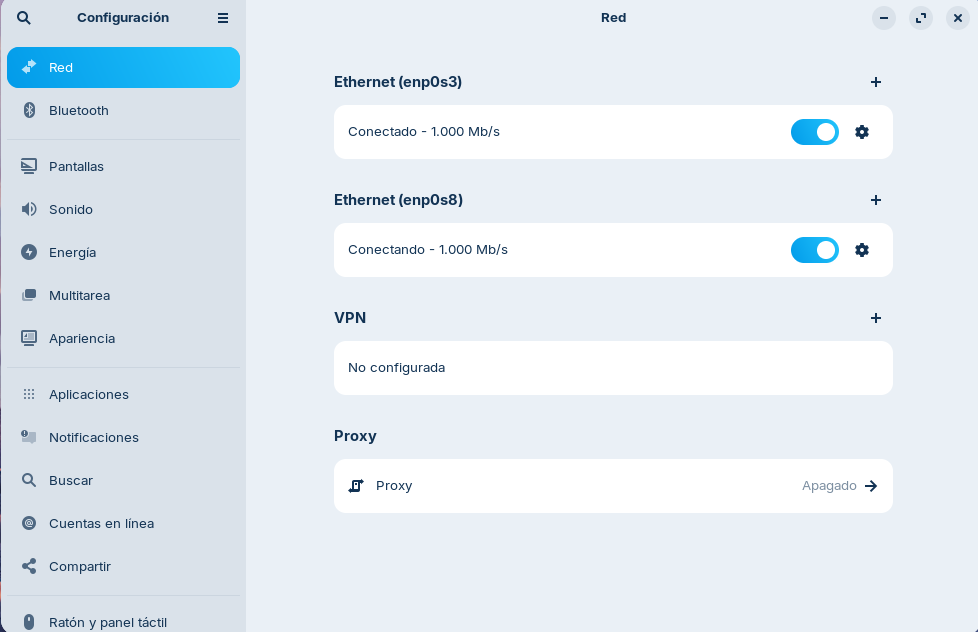
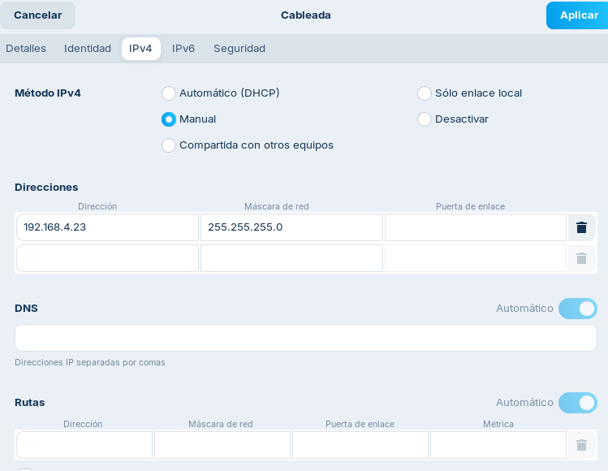
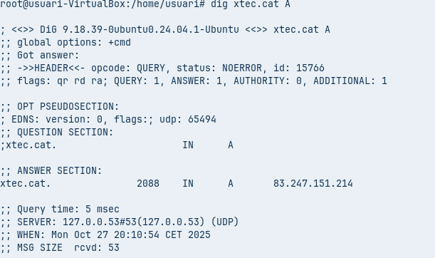
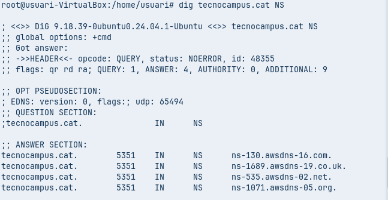
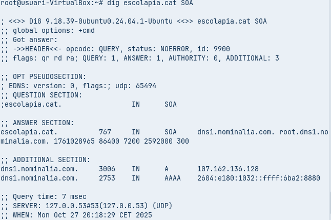
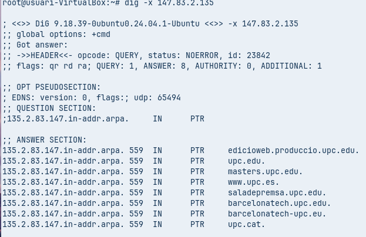
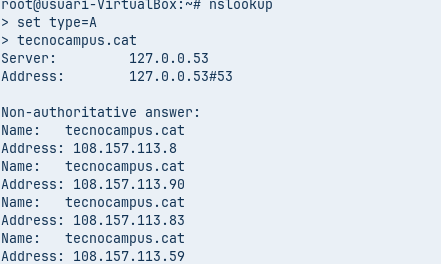

# **FUNDAMENTOS DEL SERVICIO DE DNS**

## **ADAPTADOR**

- Como se puede observar en la fotografía estamos en la aplicación ajustes, donde activaremos el adaptador puente que hemos añadido.

- Para eso tendremos que asignarle una IP y una máscara de red.

# **DIAGNOSTICO DE NOMBRES (AUDITORIA CON CLI)**

## Comanda 1: Consulta Básica de Registro A

### Ejecuta dig xtec.cat A

### Identifica la IP de respuesta, el valor TTL y el servidor que han respondido la consulta:

- IP: 83.247.151.214  
- TTL: 2088
- IP del servidor  que nos ha dado la respuesta: 127.0.0.53

## Comanda 2: Consulta de servidores de nombres (NS)

### Ejecuta dig tecnocampus.cat NS

### Análisi: ¿Cuales son los servidores de nombres autoritativos para este dominio?

- ns-130.awsdns-16.com
- ns-1689.awsdns-19.co.uk
- ns-535.awsdns-02.net
- ns.1071.awsdns-05.org

## Comanda 3: Consulta detallada de SOA

### Ejecuta dig escolapia.cat SOA

### Análisi: ¿Cual es la información del correo del administrador y el número de serie del dominio?

- Correo: root.dns1.nominalia.com
- SN: 1761028965

## Comanda 4: Consulta resolución inversa

### Ejecuta dig -x 147.83.2.135

## Análisi: ¿Que información sobre los registros se obtiene? 

- Se obtiene información sobre la IP indicada

# **Comrpobación de resolución con nslookup (Multiplataforma)**

##

